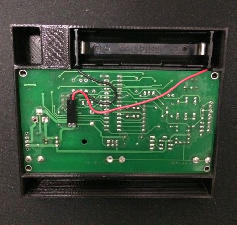
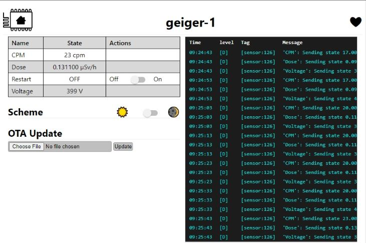

Gelidus Research Geiger Counter GC1 ESPHome component
=====================================================

The Gelidus Research GC1 geiger counter component provides radiation sensor data through
ESPHome. The device outputs JSON formatted serial data via the local serial port or over an
optional onboard ESP8266 ESP01 module. GC1 can provide the data outputs in standalone mode
as well using the LCD or over its local USB serial port at a rate of 38400 baud. The local
LCD time and date is automatically set when connected to ESPHome.

While not required for this application the GRGC1 accepts a single LiFePO4 3.2V 18650 battery. (Note: Only the specified 3.2V cell can be used. Do not install any other types.)



When connected to ESPHome the component can provide the following sensor data.

Geiger Tube radiation detected in averaged counts per minute (CPM) and counts per second (CPS).
The operating tube voltage is also available. Exposure dosage is calculated and published in micro Seiverts per hour.

The GC1's embedded code natively supports the following tubes:

    SBM20
    SI29BG
    SBM19
    LND712
    SBM20M
    SI22G
    STS5
    SI3BG
    SBM21
    SBT9
    SI1G
    J305
    M4011

Due to size variations, some tubes are wired externally while others can be
wired/soldered internally. The **SBM20** and **J305** are popular tube choices
that are directly inserted into the onboard connector sockets. These tubes are
recommened for the GRGC1. Any tube that is not in the list can be added on request.

LCD Operation
=============

Two buttons are used to operate the unit. Top button 1, walks the available
screens or moves the cursor position on a screen when in edit mode. Button 2 changes
the value when in edit mode. Edit mode is activated when button 1 is held for 1 second.
The cursor will flash when in edit mode. Holding button 1 in edit mode will save
and exit edit mode.


```
Screen 1:

    HH:MM:SS *SBBB
    DD/MM/YYYY
    ╔════════════╗
    ║ 0.12 µSv/h ║
    ╚═   LOW    ═╝
    400V 00020 CPM

    Time, Date and Sound (S) are settable.

Screen 2:

    Model:   GRGC1
    ID:   20000000
    Firmware: 2.01
    Tube:     J305
    SSID:    GRGC1
    Mode:  ESPHome

    Unit ID, and Mode are settable.
    Unit ID is only useful with a non ESPHome standalone firmware which is not
    applicable for this use case. However it can be locally set to identify a sensor.
    Mode has three values Online, Offline and ESPHome. Online/Offline modes are
    specific to a standalone state running non-esphome code and is not usefull
    when using ESPhome code on the ESP01 module. The SSID is the default AP SSID
    used in the example yaml config and is overidable but is not currently updated.

Screen 3:

    Logs:       On
    Interval:   1s
    IP:
    0.0.0.0

    Log and log interval can be set for standalone Offline/Online mode however it
    does not interact with the ESPHome code. The IP address will be updated from the ESP01
    module once it is available.
```
Powerdown/Standby and Reset
===========================

Holding Button 1 and 2 for 5 seconds will reset the unit.
Holding Button 1 and 2 for 1 second will place the unit in or out of power standby.


ESPHome configuration:

The following example configuration file can be used to connect up the GRGC1
Geiger Counter. The unit is preloaded with the captive portal enabled. It
will host an AP SSID of GRCG1 with no password allowing you to conviently
connect to your WiFi with a phone etc. Always use the api and ota passwords generated
by ESPHome's code. The sample value is for clarity only.



```
external_components:
  # pull geiger from Github @gelidusresearch grgc1 repo
  - source: github://gelidusresearch/grgc1
    components: [ geiger ]

esphome:
  name: geiger-1
  friendly_name: geiger-1

esp8266:
  board: esp01_1m

logger:
  baud_rate: 0

# Enable Home Assistant API
api:
  encryption:
    key: "2jemlP7CMyb6Y68RnbfLNWvMxKb1ziKWGRUqCeZeoNE="

ota:
  password: "624dff228eba6efdec80c5cdf50f43b8"

wifi:
  ssid: !secret wifi_ssid
  password: !secret wifi_password

  # Enable fallback hotspot (captive portal) in case wifi connection fails
  ap:
    ssid: GRGC1
    password: !secret captive_password

captive_portal:

web_server:
  port: 80
  version: 2

uart:
  tx_pin: GPIO1
  rx_pin: GPIO3
  baud_rate: 38400
  data_bits: 8
  stop_bits: 1
  parity: NONE

sensor:
  - platform: geiger
    update_interval: 10s
    model: GRGC1
    id: GC1
    voltage:
      name: "Voltage"
    geiger_cpm:
      name: CPM
    geiger_cps:
      name: CPS
    geiger_dose:
      name: Dose
    geiger_sound: false
    geiger_tube: SBM20
    time_id: sntp_time

switch:
  - platform: restart
    name: Restart

time:
  - platform: sntp
    id: sntp_time
```


